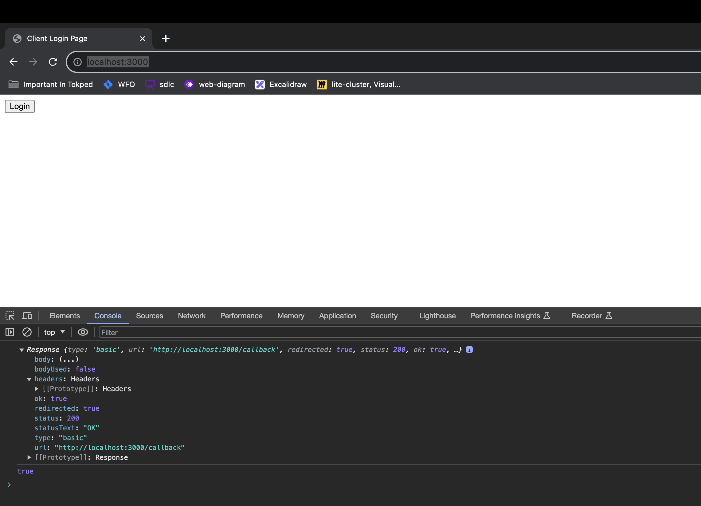

## Description

Proposal Web App Auth SDK scenario

## Prerequisite

- nodeJS, to install follow https://nodejs.org/en/download
- nodemon, to install use `npm install -g nodemon`

## Development

To run golang: `make run-golang`

To run nodejs: `make run-nodejs`

Then open http://localhost:3000/ , open your browser developer tools. And check in tab Console to check the data. 

